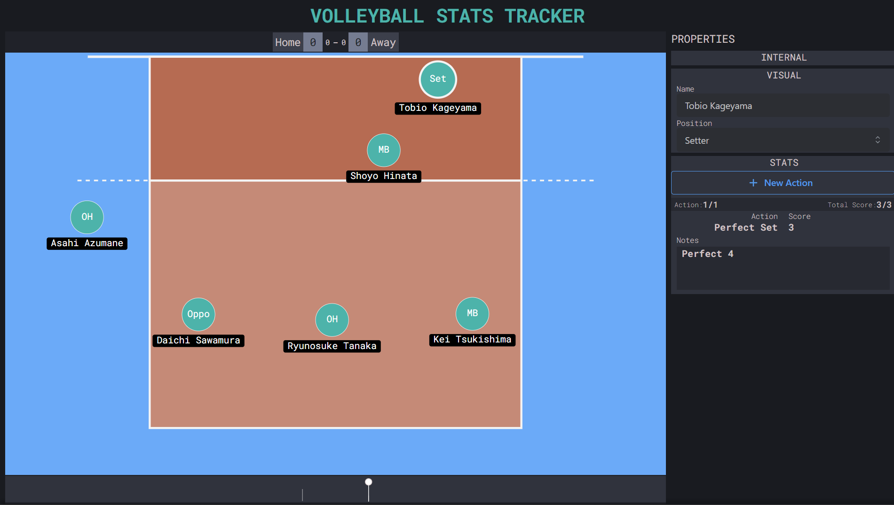

# project-volleyball-tools

 

## Description

The volleyball statistics tracking app allows coaches to record and track individual player performance data during volleyball games.

The app allows coaches to manually input data such as the number of serves, digs, kills, and blocks made by each player, as well as the number of errors committed.

This data is organized and presented in an easy-to-read format, enabling coaches to identify areas where individual players need to improve and make informed decisions about game strategy and player development.

